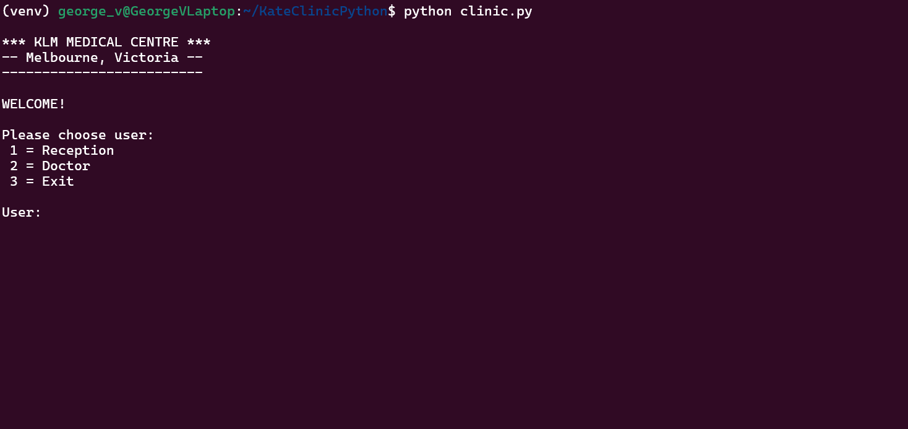
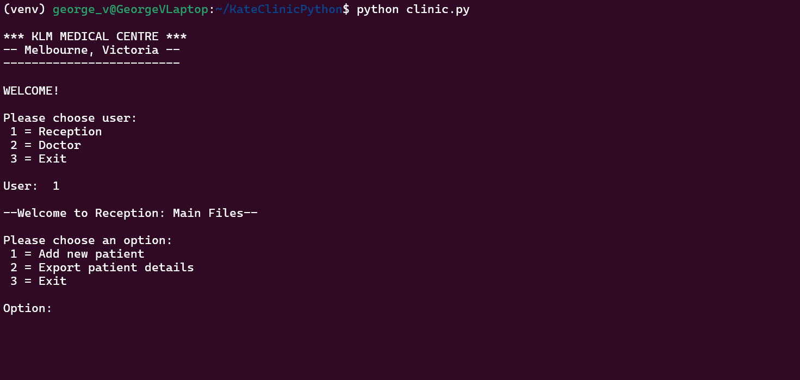
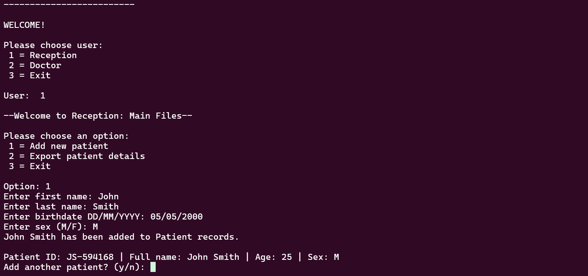
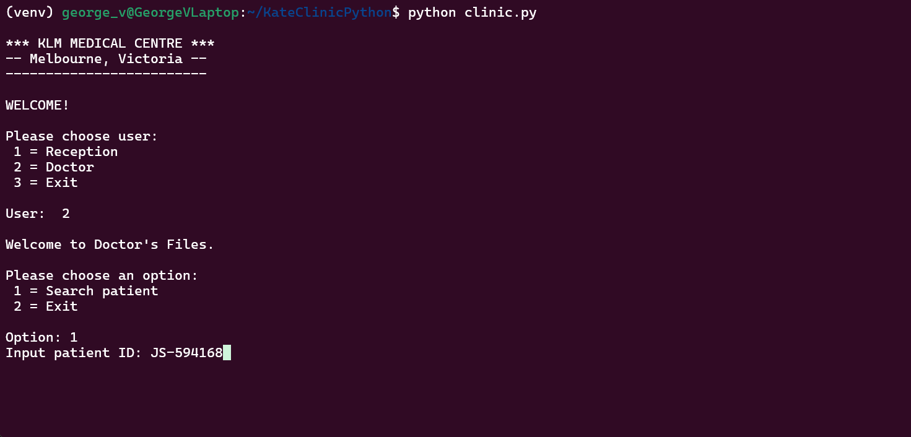
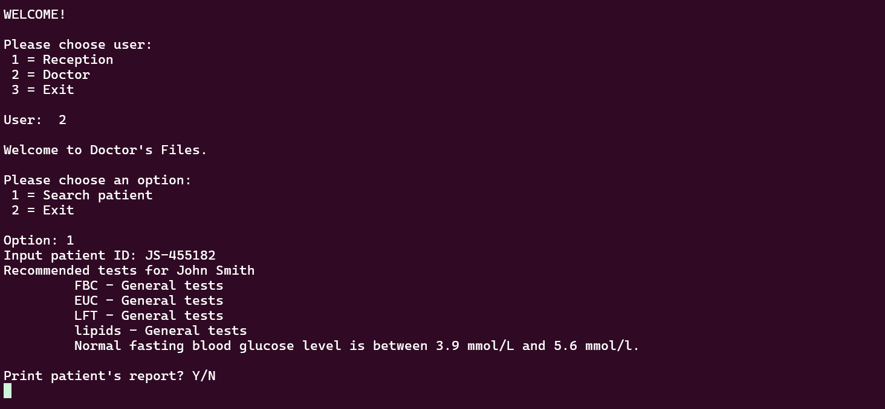
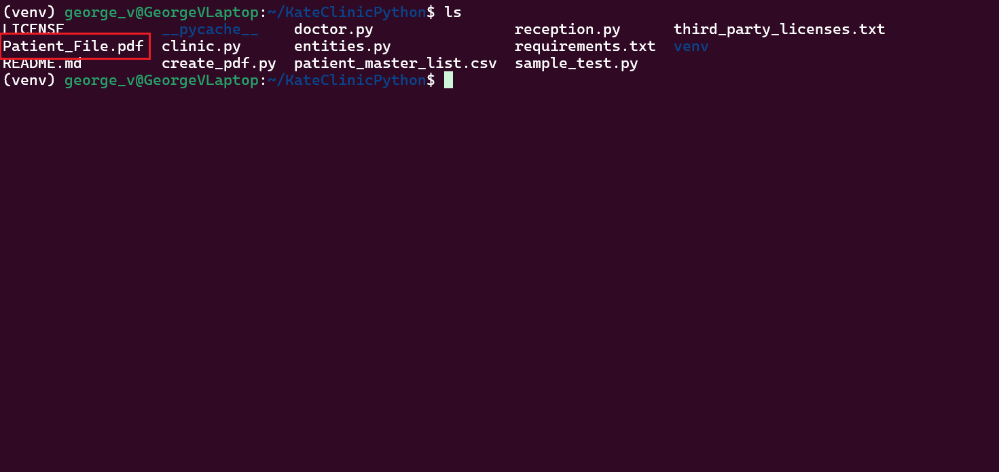

<!-- Instruction Steps -->
# Usage/Instructions

Here you will find an in depth guide on how to navigate and use the <u>**KLM LabTest Advisor**</u>.  For the brief summary, head to [README](README.md).

To utilise this app, you must have covered the installation steps prior.

Once installation is complete, to run the app, enter from the terminal, while within the app directory, this command:

You will be presented with a menu of options to chose from.  As this will most likely be the first time using the app, there will be no records of patients to choose from.  To begin inputing data, select the 'Reception' option by entering 1.

In this section, you will see the options to either add a new patient, or export patient details.

Once you have entered a new patients details, you will be asked if you would like to enter another patients details, this is done for the sake of speed, since there will be cases of multiple patient data entry at once.  In this instance, we will say no.

We can now begin exporting our patient records.  Head into the 'Reception' section, and select the 'Export patient details' option.  You will be prompted when complete.  Once we do this, we can now see access those details from the 'patient_master_list.csv' file.  To view the contents, you can view them through an IDE or through the terminal.

With our patients details ready for use, we can enter the 'Doctor' section of the app from back at the main menu.  Here is where we can achieve the our purpose for using this app.  By selecting the 'Search patient' option, you will be prompted to enter the unique patient ID.  This can be found the in the previously exported 'patient_master_list.csv' file.

After providing the unique patient ID, we will now be given the recommended list of pathology tests to undergo.  Saving time, and effort for all involved.  From here, users will be given the option of wanting to print the patient's report or not.  If yes, a pdf file will be created, containing the sensitive information.  This can be found in the app directory.

You should now have a good understanding of how the application works.  Enjoy!